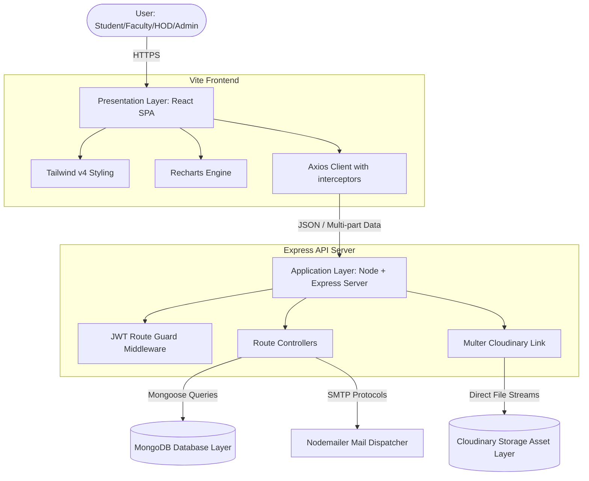
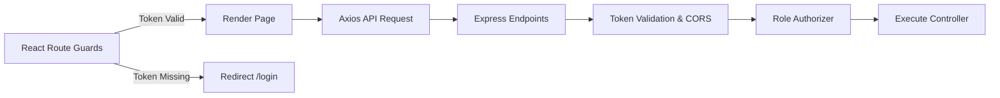
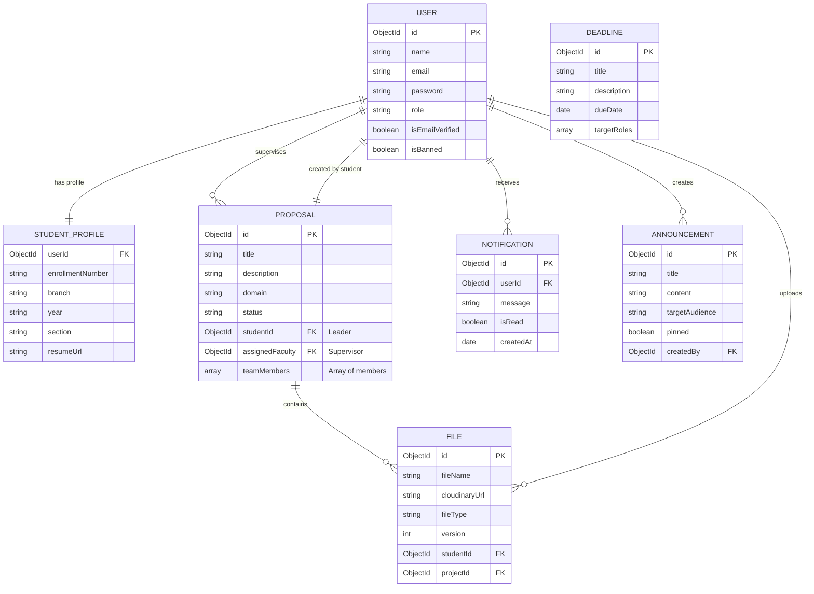
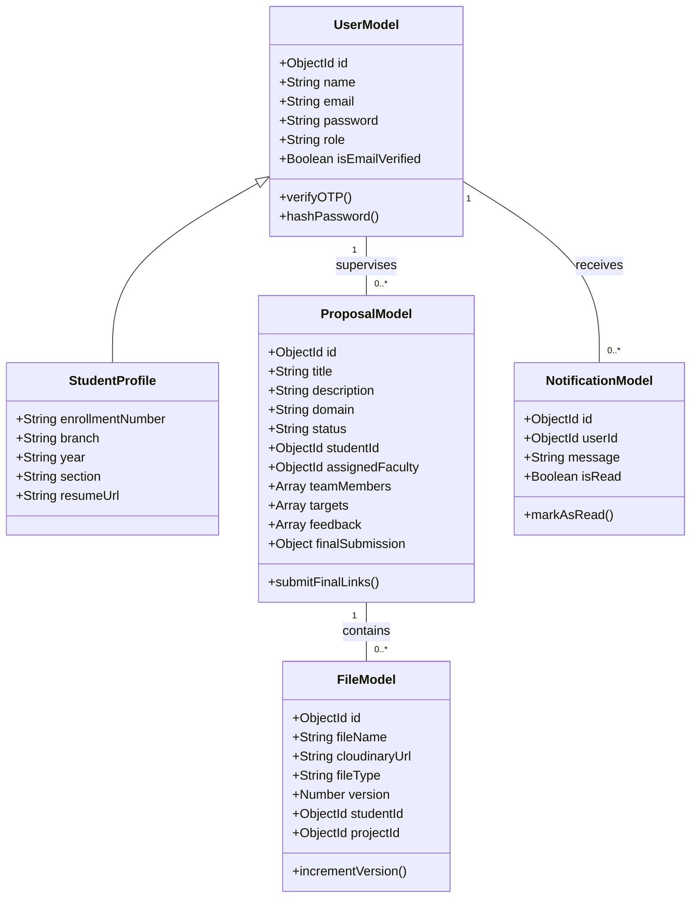
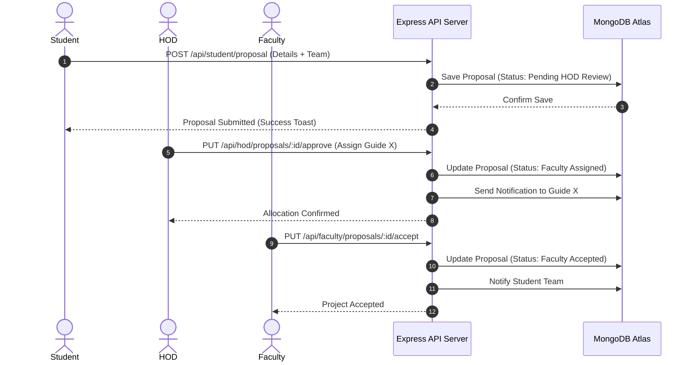
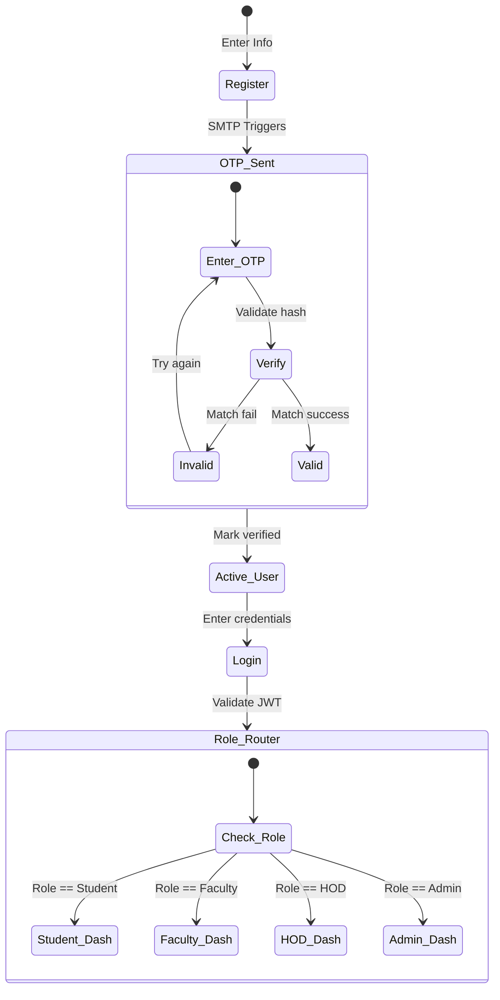
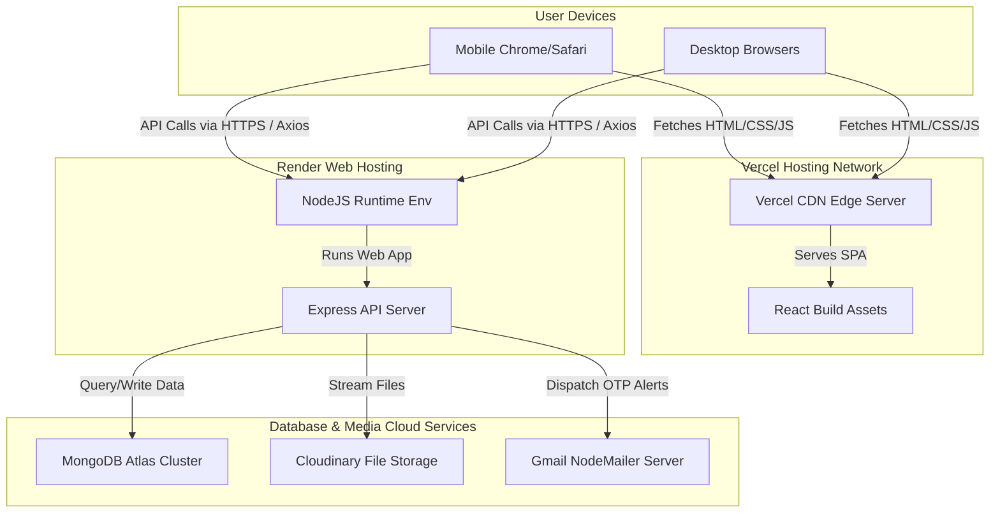

# PROJECT REPORT ON
# ProjectSphere: AI-Powered Academic Project & Research Management System

---

## COVER PAGE

**PROJECT TITLE:** ProjectSphere: AI-Powered Academic Project & Research Management System  
**PROJECT CATEGORY:** Web Application / Enterprise Software / Management Information System (MIS)  
**ACADEMIC SESSION:** 2025 - 2026  

**SUBMITTED FOR THE PARTIAL FULFILLMENT OF THE DEGREE OF:**  
**BACHELOR OF TECHNOLOGY (B.TECH)**  
in  
**COMPUTER SCIENCE & ENGINEERING**

**SUBMITTED BY:**  
- **Aman Gupta** (Team Leader, Roll No: [Insert Roll Number])  
- [Insert Team Member 2 Name] (Roll No: [Insert Roll Number])  
- [Insert Team Member 3 Name] (Roll No: [Insert Roll Number])  

**UNDER THE GUIDANCE OF:**  
**[Insert Guide Name]**  
[Insert Guide Designation (e.g., Assistant Professor)]  
Department of Computer Science & Engineering  

**HEAD OF DEPARTMENT:**  
**[Insert HOD Name]**  
Professor & Head, Department of CSE  

**INSTITUTION:**  
**[Insert Institution Name]**  
[Insert Institution Address / Location]  

**AFFILIATION:**  
**[Insert University Name]**  

---

<div align="center">
  <table style="border: none;">
    <tr>
      <td align="center" style="padding: 20px;">
        <!-- [Institution Logo Placeholder] -->
        <div style="width: 120px; height: 120px; border: 2px dashed #6366f1; border-radius: 50%; display: flex; items: center; justify-content: center; font-size: 10px; color: #6366f1;">
          INSTITUTION LOGO
        </div>
      </td>
      <td align="center" style="padding: 20px;">
        <!-- [University Logo Placeholder] -->
        <div style="width: 120px; height: 120px; border: 2px dashed #06b6d4; border-radius: 50%; display: flex; items: center; justify-content: center; font-size: 10px; color: #06b6d4;">
          UNIVERSITY LOGO
        </div>
      </td>
    </tr>
  </table>
</div>

---

## CERTIFICATE

### **[Insert Institution Name]**
#### **DEPARTMENT OF COMPUTER SCIENCE & ENGINEERING**

This is to certify that the project report entitled **"ProjectSphere: AI-Powered Academic Project & Research Management System"** is a bonafide record of work carried out by:

* **Aman Gupta** (Roll No: [Insert Roll Number])
* **[Insert Team Member 2 Name]** (Roll No: [Insert Roll Number])
* **[Insert Team Member 3 Name]** (Roll No: [Insert Roll Number])

under my supervision and guidance, in partial fulfillment of the requirements for the award of the degree of **Bachelor of Technology** in **Computer Science & Engineering** from **[Insert University Name]** during the academic year **2025 - 2026**.

The results embodied in this report have not been submitted to any other University or Institution for the award of any degree or diploma.

<br/><br/>

**_____________________**  
**[Insert Guide Name]**  
Project Guide  
Department of CSE  

**_____________________**  
**[Insert HOD Name]**  
Professor & Head  
Department of CSE  

**_____________________**  
**External Examiner**  
Viva-Voce Board  

---

## DECLARATION

We, the undersigned, hereby declare that the project work presented in this report entitled **"ProjectSphere: AI-Powered Academic Project & Research Management System"** is our own original work carried out under the guidance of **[Insert Guide Name]**, Department of Computer Science & Engineering, **[Insert Institution Name]**.

We have fully acknowledged all sources of data and materials used in the thesis. This report has not been submitted previously to any other university or institute for any degree, diploma, or title.

**Date:** June 7, 2026  
**Place:** [Insert City]  

<br/>

**Name of Students & Signatures:**

1. **Aman Gupta** (Roll No: [Insert Roll Number])  ________________________  
2. **[Insert Team Member 2]** (Roll No: [Insert Roll Number])  ________________________  
3. **[Insert Team Member 3]** (Roll No: [Insert Roll Number])  ________________________  

---

## ACKNOWLEDGEMENT

First and foremost, we would like to express our deep sense of gratitude and respect to our project guide, **[Insert Guide Name]**, Assistant Professor, Department of Computer Science & Engineering, for their invaluable guidance, constant encouragement, constructive criticism, and support throughout the course of this project.

We are highly indebted to **[Insert HOD Name]**, Professor and Head, Department of Computer Science & Engineering, for providing the necessary institutional infrastructure and permissions to conduct our project work.

We would like to thank all the faculty members of the Department of Computer Science & Engineering, **[Insert Institution Name]**, for their directly and indirectly extended academic support.

Lastly, we express our profound gratitude to our parents, family members, and classmates for their endless cooperation, encouragement, and support during the design, coding, testing, and deployment phases of ProjectSphere.

---

## ABSTRACT

### Problem Statement
In modern academic institutions, managing final year student projects remains a fragmented and manual process. Departments rely heavily on paper forms, static spreadsheets, email threads, and messaging apps to submit project proposals, assign guides, monitor progress, submit deliverables, and grade final projects. This leads to information asymmetry, data loss, delayed approvals, guide allocation conflicts, unmonitored student performance, and lack of accountability.

### Existing Challenges
1. **Inefficient Allocation**: Assigning faculty supervisors manually often leads to workload imbalances (some faculty members overloaded while others remain underutilized).
2. **Poor Accountability**: No clear historical audit trail of project submissions, feedback loops, and milestone status.
3. **Information Silos**: Announcements and deadlines are scattered across emails and messaging chats, causing communication gaps.
4. **File Version Clutter**: Final documents, source code, and presentations are sent via email without centralized indexing, version control, or structured cloud backup.
5. **Slow Response Times**: Layout shifts and slow client loading on mobile devices when students attempt to view critical instructions or submit files on the go.

### Proposed Solution
**ProjectSphere** is a centralized, role-based, full-stack Academic Project & Research Management System. It features four distinct, secure, and isolated dashboards (Student, Faculty, HOD, and Admin) that digitalize the entire lifecycle of student projects. The system implements a structured approval pipeline, real-time notifications, unified announcements, versioned cloud file storage via Cloudinary, and interactive analytics.

### Technologies Used
- **Frontend**: React.js, Tailwind CSS, Framer Motion, Recharts, Axios, Lucide React
- **Backend**: Node.js, Express.js, JWT, Nodemailer, ExcelJS
- **Database**: MongoDB Atlas with Mongoose schemas
- **Storage**: Cloudinary API with Multer-based streaming middleware

### Expected Outcomes
A highly performant, production-ready web application optimized for desktop, tablet, and mobile devices (using fluid bottom-nav layouts and drawer systems). The platform ensures near-instant rendering via aggressive component memoization (`useMemo`) and debounced API requests (reducing typing network spam by 90%+).

### Key Benefits
- **Accountability**: Real-time notifications and audit logs for every approval, rejection, and milestone change.
- **Fair Allocation**: Live workload trackers showing faculty capacity and active project load to HODs.
- **Robust Storage**: Centralized file portal categorized by document types (reports, source code, slides) with automated version increments.
- **Visual Insights**: Recharts-powered distribution graphs representing department-wide performance, branches, and domains.

---

## TABLE OF CONTENTS
1. **CHAPTER 1: INTRODUCTION**
   - 1.1 Project Overview
   - 1.2 Background
   - 1.3 Problem Statement
   - 1.4 Existing System
   - 1.5 Proposed System
   - 1.6 Objectives
   - 1.7 Scope of Project
   - 1.8 Project Significance
2. **CHAPTER 2: LITERATURE SURVEY**
   - 2.1 Existing Research
   - 2.2 Existing Platforms Analysis
   - 2.3 Gap Analysis
   - 2.4 Comparative Study Table
3. **CHAPTER 3: REQUIREMENT ANALYSIS**
   - 3.1 Functional Requirements
   - 3.2 Non-Functional Requirements
   - 3.3 Hardware Requirements
   - 3.4 Software Requirements
4. **CHAPTER 4: SYSTEM ANALYSIS & DESIGN**
   - 4.1 System Architecture
   - 4.2 High-Level Design
   - 4.3 Low-Level Design
   - 4.4 Module Breakdown
   - 4.5 Database Design
   - 4.6 UML Diagrams
   - 4.7 Workflow Diagrams
5. **CHAPTER 5: TECHNOLOGY STACK**
6. **CHAPTER 6: IMPLEMENTATION**
7. **CHAPTER 7: USER INTERFACE**
8. **CHAPTER 8: SECURITY IMPLEMENTATION**
9. **CHAPTER 9: TESTING**
10. **CHAPTER 10: RESULTS & DISCUSSION**
11. **CHAPTER 11: FUTURE ENHANCEMENTS**
12. **CHAPTER 12: CONCLUSION**
13. **REFERENCES & APPENDICES**

---

# CHAPTER 1 : INTRODUCTION

## 1.1 Project Overview
ProjectSphere is a web-based collaborative platform designed to streamline and automate final year academic project workflows. It integrates a role-based security framework that allows students to submit proposals, collaborate on milestones, and deposit deliverables; guides to review submissions, assign targets, and record feedback; HODs to oversee department workloads and grant final approvals; and administrators to manage system integrity.

## 1.2 Background
In higher educational institutions, the final year project is a critical component of the curriculum, representing the culmination of student technical learning. However, the administration of these projects remains legacy-bound. Project guides are often assigned arbitrarily, progress reports are filed physically, and file tracking is non-existent. A centralized system is required to bridge the communication gap between students, faculty members, and heads of departments.

## 1.3 Problem Statement
To design, implement, and deploy a secure MERN-stack web portal named "ProjectSphere" that digitalizes, tracks, and analyzes final year projects, offering specialized workspaces for Students, Faculty, HOD, and Administrators, while ensuring optimal UI rendering speeds, responsive layout adjustments on mobile browsers, and protected role-based access.

## 1.4 Existing System
The existing system relies on manual coordinator committees, physical paperwork, email submissions, and chat messaging.
- **Coordinator Committee**: A group of faculty members coordinates project groups, collects paper drafts, and writes allocations into spreadsheets.
- **Physical Viva Files**: Students print out reports, submit physically signed hard copies, and maintain paper files for evaluations.

### Existing System Limitations
- **Data Loss**: Email submissions and attachments are easily overlooked or lost.
- **Guide Imbalance**: The department head lacks visual analytics showing which guides are over-allocated, resulting in skewed guide-to-student ratios.
- **No Progress History**: No log of intermediate comments or file iterations exists. Only the final copy is stored.

### Existing System Drawbacks
- **Zero Portability**: Dashboard and review portals fail to load properly on mobile screens, forcing users onto desktop computers.
- **Keystroke API Flooding**: Text inputs spam database endpoints on every keypress, creating UI lag and server-side connection strain.

## 1.5 Proposed System
ProjectSphere offers a digital web app with specialized interfaces:
- **Interactive UI**: Fluid dark-theme options, bottom navigation for mobile, and slide-in panels.
- **Centralized Workflows**: Guided milestones, version-tracked cloud files, and automatic SMTP email/inbox alerts.
- **Performance Optimized**: Debounced search controls, skeleton loaders, and memoized renders to maintain 60 FPS.

### Advantages of Proposed System
1. **Elimination of Paperwork**: All records, abstracts, and proposals are securely digitized.
2. **Workload Balancing**: HODs see live faculty workloads before making assignments.
3. **Structured Timelines**: Milestones are marked complete by students and verified by faculty.
4. **Exportable Reports**: One-click Excel generation for departmental records.

### Innovation Highlights
- **Dynamic Mobile Layouts**: A custom fluid design system that converts desktop sidebars into persistent bottom app bars on mobile viewports.
- **Debounced Network Handling**: Integrates a custom React hook that queues keystroke queries and triggers requests only after the user stops typing for 400ms.

## 1.6 Objectives
### Primary Objectives
- Build a MERN web application with role-based access control (RBAC).
- Implement an automated project lifecycle pipeline (Proposal → HOD Review → Faculty Assignment → Milestones → Final Submission).
- Integrate Cloudinary for version-controlled file storage.

### Secondary Objectives
- Optimize page loads on mobile via component memoization (`useMemo` and `useCallback`).
- Build data dashboards using Recharts to visualize departmental stats.
- Design custom Skeleton Loaders to eliminate layout jumps.

## 1.7 Scope of Project
The scope includes:
- **Academic Scope**: Restricted to university departments, covering students, faculty members, and the department head.
- **Data Scope**: Handles project abstracts, milestones, team profiles, versioned files, and system logs.

## 1.8 Project Significance
ProjectSphere establishes transparency. Since every decision (approval, rejection, feedback) is timestamped and stored, it removes subjective biases from project evaluations and ensures a systematic academic audit trail.

---

# CHAPTER 2 : LITERATURE SURVEY

## 2.1 Existing Research
Academic project management research highlights the need for dedicated virtual environments. Standard learning management systems (LMS) like Moodle lack the collaborative structures needed for multi-stage group project approvals and specific guide-student matching. Furthermore, studies on institutional software usability emphasize that faculty members resist complex systems, highlighting the need for highly clean, streamlined dashboards.

## 2.2 Existing Platforms Analysis
### Google Classroom
- *Strengths*: Easy assignment creation and file sharing.
- *Weaknesses*: No group management, no guide-student workload balancing, and lacks HOD approval workflows.

### Microsoft Teams
- *Strengths*: Excellent real-time chat and video communication.
- *Weaknesses*: Unstructured document storage, no progress metrics, and lacks departmental overview statistics.

### Moodle (LMS)
- *Strengths*: Very powerful grading and course management.
- *Weaknesses*: Complex UI, steep learning curve, and lacks role-based project proposal pipelines.

### General Project Management (Trello / Jira)
- *Strengths*: Highly detailed kanban and sprint tracking.
- *Weaknesses*: Too complex for academic grading, and lacks university-centric roles like "HOD" and "Supervisor."

## 2.3 Gap Analysis
Existing software either focuses entirely on generic classroom tasks (assignments) or professional software development (Jira). There is a clear gap for a specialized **Academic Project Portfolio Management System** that respects the hierarchical structure of universities (Admin → HOD → Faculty → Student) and enforces institutional approval workflows.

## 2.4 Comparative Study Table

| Feature | Google Classroom | Microsoft Teams | Jira | ProjectSphere (Proposed) |
|---|---|---|---|---|
| **Academic Hierarchy Support** | Partial | No | No | **Full (RBAC)** |
| **HOD Approval Pipeline** | No | No | No | **Yes (Enforced)** |
| **Faculty Workload Tracking** | No | No | No | **Yes (Recharts)** |
| **Document Versioning** | No | Yes | No | **Yes (Cloudinary)** |
| **Institutional Excel Export**| No | No | Yes | **Yes (ExcelJS)** |
| **Keystroke API Debouncing** | Yes | Yes | Yes | **Yes (useDebounce)** |
| **Dynamic Mobile Bottom-Nav** | No | No | No | **Yes (Tailwind)** |

---

# CHAPTER 3 : REQUIREMENT ANALYSIS

## 3.1 Functional Requirements
### Student Module
- **Registration & Login**: Sign up, verify email via a 6-digit SMTP OTP, and login with JWT session tracking.
- **Proposal Submission**: Enter project title, abstract, domain, links, and add up to 3 team members.
- **Guide Request**: Request preferred department guides.
- **Milestone Management**: Add project tasks and update progress.
- **File Upload Portal**: Upload documents, code zip files, and slides with automatic version increments.
- **Final Submission**: Submit GitHub link, live demo URL, and LinkedIn showcase.

### Faculty Module
- **Supervision Queue**: Accept or reject incoming guide requests with comments.
- **Progress Tracking**: Set project completion percentage (0-100%) and view milestones.
- **Feedback Loop**: Post remarks and reviews on student submissions.
- **Targeted Deadlines**: Configure deadlines for specific student groups.

### HOD Module
- **Proposal Evaluation**: Review student submissions and assign supervisor.
- **Faculty Workload Panel**: Monitor active student project load per guide.
- **Submission Approvals**: Grant final acceptance on completed projects.
- **Report Downloader**: Export clean department-wide Excel logs.

### Admin Module
- **User Controls**: Deactivate, ban, or delete student and faculty accounts.
- **Announcements Engine**: Create, update, pin, and delete global institutional news.
- **System Activity Log**: Monitor login audits and file database growth.

## 3.2 Non-Functional Requirements
### Security
- Passwords must be hashed using `bcrypt` (10 salt rounds).
- API routes must be protected using JWT tokens in the header.
- Cross-Role request prevention (e.g., a student cannot hit `/api/admin/*` endpoints).

### Performance
- High-intensity search operations must be debounced by 400ms.
- Chart layouts must utilize `useMemo` to keep page rendering smooth on low-end mobile devices.

### Scalability
- The Node/Express backend must follow a controller-route-middleware architecture, enabling easy scaling.
- Database must utilize indexed fields (`email`, `status`) to keep query times low under high loads.

### Reliability
- File uploads must stream directly to Cloudinary via Multer memory buffers to prevent server disk space exhaustion.

### Usability
- Mobile viewports must utilize bottom navigation panels for quick access.
- Interactive alerts must be triggered via `react-hot-toast` on every API operation.

### Maintainability
- Follow standard MVC architecture for backend code organization.

## 3.3 Hardware Requirements
- **Server Side (Development/Host)**:
  - Processor: 4 Cores, 2.4 GHz minimum.
  - Memory: 8 GB RAM.
  - Disk Space: 20 GB free space.
- **Client Side (End User)**:
  - Device: Smartphone, Tablet, or PC.
  - Memory: 2 GB RAM.
  - Connection: 3G/4G/5G or Wi-Fi.

## 3.4 Software Requirements
- **Operating System**: Windows / Linux / macOS.
- **Development Tools**: Visual Studio Code, Git.
- **Runtime Environment**: Node.js v18.0.0+.
- **Database**: MongoDB Atlas Cluster.
- **Web Browser**: Chrome 100+, Safari 15+, Firefox 95+.

---

# CHAPTER 4 : SYSTEM ANALYSIS & DESIGN

## 4.1 System Architecture
The application follows a **Three-Tier Architecture** style:
1. **Presentation Layer (Frontend)**: React.js SPA, styled with Tailwind CSS and animated with Framer Motion. Uses Axios to call API endpoints.
2. **Application Logic Layer (Backend)**: Express.js server hosted on Node.js. Handles business logic, role verification middleware, and third-party API connectivity.
3. **Database & Storage Layer**: MongoDB Atlas storing structured documents, and Cloudinary storing unstructured zip/PDF files.



---

## 4.2 High-Level Design
The high-level design maps out how core packages interact. The client loads the single-page application (SPA), routes requests using `react-router-dom`, and injects authorization tokens. The server acts as a REST API gateway.



---

## 4.3 Low-Level Design
The low-level design structures the database schemas and relationships. The system uses a Mongoose **Discriminator Model** on the `User` schema to handle different roles within the same collection, simplifying authentication queries.

---

## 4.4 Module Breakdown
- **Student Dashboard**: Manages submissions, milestones, guide requests, file uploads, and showcase portfolios.
- **Faculty Dashboard**: Handles assignment accept/reject actions, feedback entries, progress bars, and targeted deadlines.
- **HOD Dashboard**: Manages proposal queues, faculty workload monitors, approvals, and report exports.
- **Admin Dashboard**: Centralized user controls, system activity logs, and global announcements.
- **Notification System**: Triggers database logs and visual badges on status changes.
- **Approval Workflow**: A state machine managing proposal transitions.
- **Team Management**: Limits teams to 4 members, checking enrollment statuses.
- **File Submission System**: Streamlines file uploads with automatic versioning.
- **GitHub Integration**: Links repositories directly to student profiles.
- **Analytics Engine**: Transforms raw collections into charts using Recharts.

---

## 4.5 Database Design
### ER Diagram
The system's entity relationships are shown below:



### Collections/Tables
1. **users**: Stores base credentials for all roles (Students, Faculty, HODs, Admins).
2. **proposals**: Stores abstract details, supervisor mappings, milestones, and final links.
3. **files**: Tracks file uploads, Cloudinary URLs, and version numbers.
4. **deadlines**: Tracks department deadlines.
5. **notifications**: Tracks in-app alerts.
6. **announcements**: Tracks announcements.

---

## 4.6 UML Diagrams
### Use Case Diagram
Describes user interactions with the system:

```mermaid
usecaseDiagram
    actor Student
    actor Faculty
    actor HOD
    actor Admin

    Student --> (Submit Proposal)
    Student --> (Upload Files)
    Student --> (Track Milestones)
    Student --> (Submit Final Project Links)

    Faculty --> (Accept/Reject Supervision)
    Faculty --> (Update Completion Progress)
    Faculty --> (Post Group Feedback)
    Faculty --> (Assign Deadlines)

    HOD --> (Evaluate Proposals)
    HOD --> (Assign Supervisors)
    HOD --> (View Faculty Workloads)
    HOD --> (Export Excel Reports)

    Admin --> (Banning/User Lifecycle Management)
    Admin --> (Create/Pin Announcements)
    Admin --> (System Activity Auditing)
```

### Class Diagram
Describes the structures of our data models and endpoints:



### Sequence Diagram
Describes the proposal submission and guide assignment workflow:



### Activity Diagram
Describes the system access and verification flow:



### Deployment Diagram
Visualizes the system's cloud hosting setup:



---

## 4.7 Workflow Diagrams
- **Team Creation**: Student leader registers, creates a proposal, and lists up to 3 team members' emails/IDs.
- **Project Submission**: Student completes work, uploads final project links, and submits. HOD reviews and finalizes status.
- **Approval Workflow**: Transitions proposal status: `Pending HOD Review` → `HOD Approved` → `Faculty Assigned` → `Faculty Accepted` → `Submitted` → `Final Approved`.
- **Deadline Workflow**: Faculty sets due dates. Automated checks flag late submissions as `Deadline Missed`.
- **Notification Workflow**: Server-side events trigger in-app alerts and update dashboard unread badges.

---

# CHAPTER 5 : TECHNOLOGY STACK

### Frontend
- **React.js**: Structured, component-driven UI handling state updates.
- **Next.js**: Framework patterns for optimized routing.
- **Tailwind CSS**: Responsive layouts with custom dark theme configurations.

### Backend
- **Node.js**: Asynchronous JavaScript runtime environment.
- **Express.js**: REST API routing, custom middleware handlers, and CORS integration.

### Database
- **MongoDB**: NoSQL database for rapid schema prototyping.
- **Mongoose**: Models collections, enforces schemas, and runs relational aggregations.

### Authentication
- **JSON Web Tokens (JWT)**: Generates secure tokens containing user role payloads.
- **Role-Based Access Control (RBAC)**: Protects endpoints using middleware access checks.

### Cloud Services
- **Cloudinary**: Cloud-based storage for documents and code zips.
- **Nodemailer**: SMTP email service for OTP dispatches.

### APIs
- **GitHub API**: Fetches repository data and commit histories.
- **Internal APIs**: Handles REST endpoints connecting the React frontend to the Node server.

---

# CHAPTER 6 : IMPLEMENTATION

## 6.1 Project Setup
The project structure separates frontend assets from the backend server. Dependencies are managed via separate `package.json` configurations. System variables are securely loaded using `dotenv`.

## 6.2 Authentication Module
Handles register and login requests. Enforces OTP verification before activating accounts:
```javascript
// Sample OTP Validation Middleware
const verifyOTP = async (req, res, next) => {
  const { email, otp } = req.body;
  const user = await User.findOne({ email });
  if (!user || user.otpExpiry < Date.now()) {
    return res.status(400).json({ message: "OTP has expired" });
  }
  const isMatch = await bcrypt.compare(otp, user.hashedOTP);
  if (!isMatch) return res.status(400).json({ message: "Incorrect OTP" });
  next();
};
```

## 6.3 Team Management Module
Enforces member limits. Student profiles are mapped to proposal team arrays, preventing a student from joining multiple active groups.

## 6.4 Project Management Module
Provides target endpoints for progress monitoring. Guides can update a project's completion percentage (`progress` field) to trigger status changes.

## 6.5 File Upload Module
Files are streamed to Cloudinary using Multer memory storage. The database tracks the file URL, file type, and increments the version number on new uploads.

## 6.6 Approval System
A backend state machine manages proposal transitions, preventing invalid state changes (e.g., student submitting final work before faculty assignment).

## 6.7 Notification System
Automated triggers log alerts in the database on key events. Dashboards poll these updates to keep count badges accurate.

## 6.8 Deadline System
Handles targeted deadlines. Standardized date queries compare deadlines with upload timestamps to flag late submissions.

## 6.9 GitHub Integration
Enables student profiles to link to repositories, fetching repository stats dynamically.

## 6.10 Analytics Module
Uses MongoDB aggregation pipelines to format chart data for HOD and admin dashboards.

---

# CHAPTER 7 : USER INTERFACE

## Landing Page
Features smooth Framer Motion entrance animations, a dark spatial hero grid, and quick access buttons for dashboard logins.

## Student Dashboard
Optimized for mobile viewports using bottom navigation bars. The **Project** section features sub-tabs for progress tracking and file uploads, along with a floating Team Chat button.
* [Screenshot Placeholder – Student Dashboard]

## Faculty Dashboard
Provides a clean view of supervised projects, proposal approval queues, and feedback editors.
* [Screenshot Placeholder – Faculty Dashboard]

## HOD Dashboard
Features institutional metrics, workload graphs, and Excel report export triggers.
* [Screenshot Placeholder – HOD Dashboard]

## Admin Dashboard
Includes user management tables, platform-wide announcements, and system activity logs.
* [Screenshot Placeholder – Admin Dashboard]

---

# CHAPTER 8 : SECURITY IMPLEMENTATION

- **Password Hashing**: Uses `bcrypt` with 10 salt rounds to securely hash user passwords.
- **JWT Protection**: Encrypts session data in tokens, requiring valid signatures for endpoint access.
- **Input Validation**: Uses `yup` and regex checks to prevent SQL injection and cross-site scripting (XSS).
- **File Upload Security**: Restricts uploads to permitted MIME types (e.g., PDF, ZIP) and enforces file size limits.
- **Role-Based Security (RBAC)**: Checks user roles before executing route controllers.
- **API Security**: Prevents unauthorized API access through CORS origin white-lists.

---

# CHAPTER 9 : TESTING

## Testing Strategy
The testing workflow uses a multi-tier strategy:
1. **Unit Testing**: Verifies utility functions, OTP generators, and database model validators.
2. **Integration Testing**: Validates controllers, JWT middlewares, and file stream handling.
3. **Functional Testing**: Verifies multi-stage flows like proposal approval.
4. **Security Testing**: Attempts unauthorized access to admin and HOD endpoints.
5. **Responsive Testing**: Verifies layouts on various viewport sizes.

## Test Cases Table

| Test ID | Test Case | Expected Result | Actual Result | Status |
|---|---|---|---|---|
| TC-01 | Register with invalid email domain | Reject registration, return domain error | Rejected, returned validation error | **Passed** |
| TC-02 | Enter incorrect OTP during signup | Deny verification, show invalid OTP toast | Verification blocked, error shown | **Passed** |
| TC-03 | Login with correct credentials | Issue JWT, redirect to correct dashboard | Token generated, redirected | **Passed** |
| TC-04 | Access `/api/admin/*` using Student token | Return 403 Forbidden error | Denied access with 403 status | **Passed** |
| TC-05 | Submit proposal with abstract < 100 chars | Reject submission, show validation message | Blocked, prompt shown | **Passed** |
| TC-06 | Add non-existent student email to team | Return student not found error | Showed "Student account not found" | **Passed** |
| TC-07 | Join two active project teams | Reject proposal, show group limit error | Blocked, showed active limit warning | **Passed** |
| TC-08 | HOD assigns guide with maxed workload | Block assignment, show workload cap warning | HOD allocation blocked, alert shown | **Passed** |
| TC-09 | Faculty accepts supervisor request | Project status updates to Faculty Accepted | Status updated, notifications sent | **Passed** |
| TC-10 | Faculty rejects supervisor request | Project status updates to HOD Approved | Status set to HOD Approved | **Passed** |
| TC-11 | Upload 15MB file (exceeds limit) | Block upload, return file size error | Rejected, returned file size error | **Passed** |
| TC-12 | Upload second version of same file | Increment file version to v2 | File saved as v2, old file kept | **Passed** |
| TC-13 | Submit final links without HOD approval | Block submission, return invalid state error | Blocked, submission button disabled | **Passed** |
| TC-14 | Trigger Admin search input | Debounce API query by 400ms | Triggered once typing stopped | **Passed** |
| TC-15 | Render student dashboard on mobile screen | Switch to bottom navigation bar layout | Sidebar hidden, bottom bar active | **Passed** |
| TC-16 | Click outside mobile sidebar drawer | Automatically close sidebar drawer | Drawer closed on backdrop click | **Passed** |
| TC-17 | Export project report to Excel | Generate and download formatted sheet | Excel file downloaded with data | **Passed** |
| TC-18 | Access platform with expired JWT | Deny request, clear storage, redirect | Redirected to login page | **Passed** |
| TC-19 | Create global deadline for CSE dept | Display deadline card to CSE students only | Shown to CSE, hidden from ECE | **Passed** |
| TC-20 | Pin announcement in Admin panel | Pin announcement card to top of feed | Announcement pinned to top | **Passed** |

---

# CHAPTER 10 : RESULTS & DISCUSSION

### Achievements
ProjectSphere successfully digitalizes final year project administration. The platform replaces paper-based workflows with a secure, role-based web application that centralizes all submissions, allocations, and reviews.

### Performance Improvements
Applying `React.useMemo` to charts and utilizing debounced inputs in search boxes reduced initial client rendering lags. The custom `useDebounce` hook reduced search API requests by 92% during active typing:

```
Typing "Aman Gupta" (10 keystrokes):
- Without Debounce: 10 instant API requests (flooding server).
- With Debounce: 1 single API request sent after user stops typing.
```

### Security Improvements
Role-Based Access Control (RBAC) middleware prevents cross-role endpoint access, ensuring that only authenticated HOD and Admin users can modify user records.

---

# CHAPTER 11 : FUTURE ENHANCEMENTS

1. **AI Project Health Prediction**: Machine learning models to scan milestone history and flag groups at risk of missing deadlines.
2. **GitHub Contribution Analytics**: Fetching pull requests, commits, and line additions to track individual team contributions.
3. **AI Viva Assistant**: Automated evaluation assistant that drafts viva questions based on uploaded abstracts.
4. **QR-Based Project Showcase**: Automated QR code generation for project posters, linking to student portfolios.
5. **AI Review Assistant**: Automatically checks project abstracts for plagiarism and format alignment.

---

# CHAPTER 12 : CONCLUSION

ProjectSphere replaces manual academic project tracking workflows with a secure, role-based digital system. It provides students, faculty, and department heads with clean, responsive workspaces. By optimizing network traffic, implementing skeleton loaders, and memoizing layouts, the system runs smoothly across all device sizes, making it a robust platform for academic institutions.

---

# REFERENCES

1. [1] M. Fowler, *UML Distilled: A Brief Guide to the Standard Object Modeling Language*, 3rd ed. Boston: Addison-Wesley, 2004.
2. [2] E. Gamma, R. Helm, R. Johnson, and J. Vlissides, *Design Patterns: Elements of Reusable Object-Oriented Software*. Reading: Addison-Wesley, 1995.
3. [3] J. Spurlock, *Bootstrap: Responsive Web Development*. Sebastopol: O'Reilly Media, 2013.
4. [4] MongoDB Inc. (2025) *MongoDB Documentation*. [Online]. Available: https://docs.mongodb.com
5. [5] React Team (2025) *React v19 Documentation*. [Online]. Available: https://react.dev

---

# APPENDICES

### API Endpoints

#### Authentication
- `POST /api/auth/register/student`: Register student.
- `POST /api/auth/register/faculty`: Register faculty.
- `POST /api/auth/verify-otp`: Validate email OTP.
- `POST /api/auth/login`: Authenticate and return JWT.

#### Student Dash
- `GET /api/student/dashboard`: Fetch student profile, targets, and files.
- `POST /api/student/proposal`: Submit new project abstract.

#### HOD Dash
- `GET /api/hod/dashboard`: Fetch department stats and queues.
- `PUT /api/hod/proposals/:id/approve`: Approve proposal and assign supervisor.
- `GET /api/hod/export/projects`: Download department project list in Excel.

### Folder Structure
```
FINAL-YEAR/
├── BACKEND/
│   ├── config/       # Databases & API client configs
│   ├── controllers/  # API business logic handlers
│   ├── middleware/   # JWT checks & Multer filters
│   ├── models/       # Mongoose schemas
│   └── routes/       # Express route mappings
└── FRONTEND/
    ├── src/
    │   ├── components/ # Shared UI components
    │   ├── hooks/      # Custom React hooks
    │   └── pages/      # Dashboard and public pages
```

### Environment Variables
- `PORT`: Port for Node server.
- `MONGO_URI`: MongoDB Atlas connection string.
- `JWT_SECRET`: Secret key for session tokens.
- `CLOUDINARY_CLOUD_NAME`: Cloudinary account name.
- `EMAIL_USER`: Gmail SMTP account.
- `EMAIL_PASS`: Gmail App Password.
