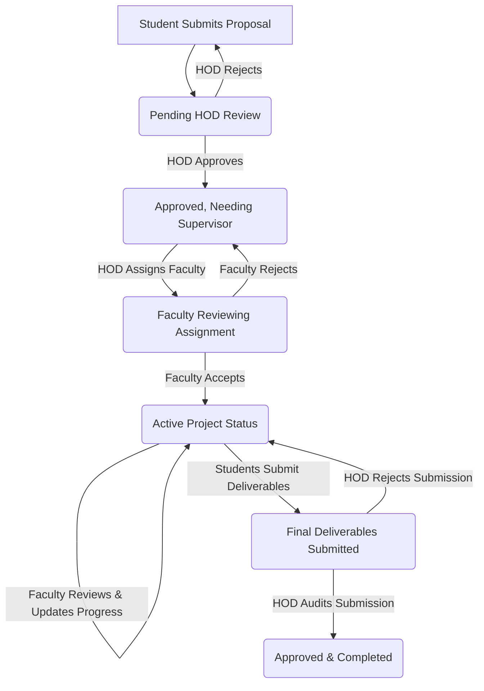

<div align="center">

<br/>


&nbsp;

&nbsp;

&nbsp;


<br/><br/>

<h1>🌐 ProjectSphere</h1>
<h3><i>AI-Powered Final Year Project & Research Management System</i></h3>

<p>
  A centralized, role-based academic portal that digitalizes the complete lifecycle of final year projects —<br/>
  from proposal submission to final delivery — for Students, Faculty, HOD, and Administrators.
</p>

<br/>

<a href="#-what-is-projectsphere"><b>📖 Overview</b></a> &nbsp;|&nbsp;
<a href="#-tech-stack"><b>💻 Tech Stack</b></a> &nbsp;|&nbsp;
<a href="#-core-workflows--approval-pipeline"><b>🔄 Workflows & Approvals</b></a> &nbsp;|&nbsp;
<a href="#-role-based-dashboards--mobile-redesign"><b>✨ Dashboards & Mobile UX</b></a> &nbsp;|&nbsp;
<a href="#-platform-sub-systems"><b>🛠️ Subsystems</b></a> &nbsp;|&nbsp;
<a href="#-performance--responsiveness-optimizations"><b>⚡ Performance</b></a> &nbsp;|&nbsp;
<a href="#-how-to-run-locally"><b>⚙️ Setup</b></a> &nbsp;|&nbsp;
<a href="#-api-routes-summary"><b>🌐 API Routes</b></a>

<br/><br/>

---

</div>

<h2>🔎 What is ProjectSphere</h2>

<p>
<b>ProjectSphere</b> is a <b>full-stack, production-ready academic project management platform</b> built for engineering colleges and universities to streamline the entire final year project (FYP) and research management process. 
</p>

<p>
The platform replaces fragmented, manual spreadsheets and paper forms with a structured, role-specific digital pipeline that gives every stakeholder — students, faculty supervisors, the Head of Department, and system administrators — a dedicated workspace and a single source of truth.
</p>

<br/>

<h2>🔄 Core Workflows & Approval Pipeline</h2>

<p>ProjectSphere enforces a strict, state-driven academic lifecycle for all final year project groups:</p>



<h3>1. Proposal Approval System</h3>
<ul>
  <li><b>Submission:</b> Student leaders submit draft proposals (100–1000 character abstracts, selected domain, target team size, and member names).</li>
  <li><b>Departmental Audit:</b> HOD evaluates the abstract. If HOD rejects, the student receives feedback notifications and can edit and resubmit. If approved, the project transitions to supervisor allocation.</li>
</ul>

<h3>2. Supervisor Assignment System</h3>
<ul>
  <li><b>Allocation:</b> HOD assigns an approved faculty member from the workload tracking list.</li>
  <li><b>Enforcement:</b> The assigned faculty supervisor receives the request. The faculty can accept the project group (marking the status as <i>Active</i>) or reject it (providing a reason, returning the project to the HOD allocation queue).</li>
</ul>

<h3>3. Milestone & Progress Reviews</h3>
<ul>
  <li><b>Milestones:</b> Students define custom project targets (e.g., Database Design, API Development) and update progress statuses (Pending, Ongoing, Completed).</li>
  <li><b>Supervisor Sign-off:</b> Faculty reviews targets, sends notes, and adjusts the project progress percentage slider (0% to 100%).</li>
</ul>

<h3>4. Final Submission Review System</h3>
<ul>
  <li><b>Asset Linking:</b> On project completion, students submit links to the Live Demo, the GitHub Repository, and a LinkedIn showcase.</li>
  <li><b>Review Routing:</b> Submissions enter the HOD queue. HOD can review links and uploaded documents, then choose to mark the project as officially completed (Accepted) or route it back to the supervisor with corrections.</li>
</ul>

<br/>

<h2>✨ Role-Based Dashboards & Mobile UX</h2>

<p>ProjectSphere provides a fully tailored, responsive user interface for four distinct roles:</p>

<table border="1" cellpadding="10" cellspacing="0" width="100%">
  <thead>
    <tr>
      <th>Role Workspace</th>
      <th>Key Features & Modules</th>
      <th>Desktop & Mobile Viewport Adaptations</th>
    </tr>
  </thead>
  <tbody>
    <tr>
      <td><b>🎓 Student Dashboard</b></td>
      <td>
        <ul>
          <li>Proposal Submission & Edit</li>
          <li>Target/Milestone Setter</li>
          <li>Cloud File Uploads with Versioning</li>
          <li>Real-time Team Chat Channel</li>
          <li>Final Portfolios & Resume Uploads</li>
        </ul>
      </td>
      <td>
        <ul>
          <li><b>Bottom Navigation Bar:</b> Replaces the sidebar on mobile browsers for vertical space optimization.</li>
          <li><b>Project Sub-navigation Tabs:</b> Sub-navigation for project details, milestones, and deliverables.</li>
          <li><b>Chat FAB:</b> Sticky button on mobile to instantly pop open the messaging channel.</li>
        </ul>
      </td>
    </tr>
    <tr>
      <td><b>👨‍🏫 Faculty Dashboard</b></td>
      <td>
        <ul>
          <li>Supervision load slot counts</li>
          <li>Supervisor assignment accept/decline queues</li>
          <li>Project timeline, feedback tracker, progress controls</li>
          <li>Interactive project progress charts</li>
        </ul>
      </td>
      <td>
        <ul>
          <li><b>Drawer Sidebar:</b> Collapsible mobile side drawer with backdrop click-dismissal.</li>
          <li><b>Announcement FAB:</b> Floating button on mobile to publish announcements on-the-go.</li>
        </ul>
      </td>
    </tr>
    <tr>
      <td><b>🏢 HOD Dashboard</b></td>
      <td>
        <ul>
          <li>Proposal queues & supervisor assigner</li>
          <li>Faculty manual registration & approval</li>
          <li>Workload-to-Capacity analytics</li>
          <li>Milestone deadline assigner</li>
          <li>CSV Report Export (filtered by approval types)</li>
        </ul>
      </td>
      <td>
        <ul>
          <li><b>Compact Double Column Grid:</b> High-density stats cards optimized for mobile screens.</li>
          <li><b>Faculty FAB:</b> Quick register button on mobile devices.</li>
        </ul>
      </td>
    </tr>
    <tr>
      <td><b>🛡️ Admin Control Center</b></td>
      <td>
        <ul>
          <li>Global project pipeline overview</li>
          <li>User status management (verified, banned, pending)</li>
          <li>Active login and file upload logs</li>
          <li>Institutional announcement manager</li>
        </ul>
      </td>
      <td>
        <ul>
          <li><b>Responsive Tables:</b> Overflow-scroll wrappers for multi-column user grids.</li>
          <li><b>Detailed Row Expansions:</b> Mobile accordion view of student profiles, files, and project details.</li>
        </ul>
      </td>
    </tr>
  </tbody>
</table>

<br/>

<h2>🛠️ Platform Sub-Systems</h2>

<h3>🔔 Database-Driven Notification Log</h3>
<p>
ProjectSphere features a robust, database-persisted notifications log. Unread counters are dynamically tracked for each user and updated through polling. Notifications are triggered automatically upon key events:
</p>
<ul>
  <li>Proposal approvals/rejections by HOD.</li>
  <li>Supervisor assignment or rejection by HOD/Faculty.</li>
  <li>New supervisor feedback or progress updates.</li>
  <li>Global milestones and deadlines established by HOD/Faculty.</li>
</ul>

<h3>📁 Cloud File Submission & Versioning Module</h3>
<p>
Utilizes <b>Multer</b> combined with the <b>Cloudinary SDK</b> to provide structured file uploads:
</p>
<ul>
  <li><b>Categorized Uploads:</b> Students upload deliverables labeled by type (e.g., SRS Document, Codebase, Presentation, Research Paper).</li>
  <li><b>Version Control:</b> Re-uploading a file categories automatically increments version markers (e.g., v1 → v2) rather than overwriting files, maintaining an audit trail for faculty review.</li>
</ul>

<h3>📊 Interactive Analytics Modules</h3>
<p>
Integrates <b>Recharts</b> for visualizations:
</p>
<ul>
  <li><b>Branch & Domain Distribution:</b> Interactive PieCharts showing project spreads.</li>
  <li><b>Faculty Workload Tracker:</b> Dual-bar charts displaying assigned students vs max capacity (default 60 slots).</li>
  <li><b>Progress Steppers:</b> Milestone completion distributions.</li>
</ul>

<h3>💬 Team Management & Inline Chat</h3>
<p>
Provides a built-in collaboration engine:
</p>
<ul>
  <li><b>Group Allocation:</b> Groups consist of a project leader (creator) and up to 3 team members.</li>
  <li><b>Messaging Channel:</b> Inline text chat channel for each project. Students, supervisors, and HODs can discuss project details, with automatic scroll-to-bottom and time stamping.</li>
</ul>

<br/>

<h2>🔒 Security Architecture</h2>

<ul>
  <li><b>Token Authentication:</b> Implements secure stateless login with JWT access tokens and refresh tokens.</li>
  <li><b>Credential Hashing:</b> Passwords hashed on register/reset using <code>bcrypt</code>.</li>
  <li><b>Role-Based Route Guards:</b> Custom middleware locks down API endpoints. Admin cannot access Student methods, Faculty cannot perform HOD approvals, etc.</li>
  <li><b>OTP Email Verification:</b> NodeMailer (SMTP App password flow) sends 6-digit OTPs for initial registration verification and password recovery.</li>
</ul>

<br/>

<h2>⚡ Performance & Responsiveness Optimizations</h2>

<p>To eliminate lag, rendering freezes, and API request spam on mobile and tablet devices, the frontend codebase has been updated with several optimizations:</p>

<h3>1. API Request Debouncing</h3>
<p>
Introduced a custom <code>useDebounce</code> React hook. Typings in search inputs (e.g., student and faculty searches in the Admin Panel) are debounced by 400ms before triggering API calls, reducing keystroke network spam.
</p>

<h3>2. Computation & React Memoization</h3>
<p>
Large arrays, Recharts data maps, and filter computations are memoized using <code>React.useMemo</code>. This prevents recalculating coordinates and filtering thousands of projects during state updates from notification polling.
</p>

<h3>3. Modern Dynamic CSS Viewports</h3>
<p>
Updated height constraints from static <code>h-screen</code> to dynamic <code>h-[100dvh]</code> on all drawer sidebars and layouts. This prevents vertical overflows and hidden content caused by mobile browser address bars.
</p>

<h3>4. Pulsating Skeleton Layouts</h3>
<p>
Replaced full-screen loading spinners with pulsating skeleton loaders that mimic the dashboard dashboards. This reduces layout shifts and improves perceived rendering performance.
</p>

<br/>

<h2>💻 Tech Stack</h2>

<table border="1" cellpadding="10" cellspacing="0" width="100%">
  <thead>
    <tr>
      <th>Layer</th>
      <th>Technology</th>
      <th>Purpose</th>
    </tr>
  </thead>
  <tbody>
    <tr>
      <td><b>Frontend Framework</b></td>
      <td><code>React 19</code> + <code>Vite</code></td>
      <td>Component-based user interface with hot module replacement</td>
    </tr>
    <tr>
      <td><b>Styling</b></td>
      <td><code>TailwindCSS</code></td>
      <td>Utility-first responsive and modern UI layout engine</td>
    </tr>
    <tr>
      <td><b>Animations</b></td>
      <td><code>Framer Motion</code></td>
      <td>Smooth mobile drawer transitions and tab switches</td>
    </tr>
    <tr>
      <td><b>Charts</b></td>
      <td><code>Recharts</code></td>
      <td>Visual analytics (BarCharts, PieCharts, Cell)</td>
    </tr>
    <tr>
      <td><b>Icons</b></td>
      <td><code>lucide-react</code></td>
      <td>Scalable and consistent vector icons</td>
    </tr>
    <tr>
      <td><b>HTTP Client</b></td>
      <td><code>axios</code></td>
      <td>API requests with automated header token interceptors</td>
    </tr>
    <tr>
      <td><b>Backend Framework</b></td>
      <td><code>Node.js</code> + <code>Express.js</code></td>
      <td>Stateless REST APIs and institutional business logic</td>
    </tr>
    <tr>
      <td><b>Database</b></td>
      <td><code>MongoDB Atlas</code> + <code>Mongoose</code></td>
      <td>NoSQL document database with schemas and discriminators</td>
    </tr>
    <tr>
      <td><b>File Storage</b></td>
      <td><code>Cloudinary</code> + <code>Multer</code></td>
      <td>Deliverable upload storage with auto-generated secure URLs</td>
    </tr>
    <tr>
      <td><b>Email Service</b></td>
      <td><code>Nodemailer</code></td>
      <td>SMTP mailer for secure OTP verification</td>
    </tr>
  </tbody>
</table>

<br/>

<h2>📁 Project Directory Structure</h2>

```bash
FINAL-YEAR/
│
├── 📁 FRONTEND/                          # React + Vite client application
│   ├── public/                           # Static assets
│   ├── src/
│   │   ├── components/                   # Reusable UI components
│   │   │   ├── Navbar.jsx                # Responsive top navigation bar
│   │   │   ├── Footer.jsx                # Dark-themed site footer
│   │   │   └── Sidebar.jsx               # Collapsible, h-[100dvh] drawer sidebar
│   │   │
│   │   ├── hooks/
│   │   │   └── useDebounce.js            # Custom search debouncer hook
│   │   │
│   │   ├── pages/
│   │   │   ├── Home.jsx                  # Main landing page
│   │   │   ├── About.jsx                 # About/mission page
│   │   │   ├── Contact.jsx               # Contact form
│   │   │   ├── Login.jsx                 # Login with password reset OTP flow
│   │   │   ├── StudentRegister.jsx       # Student signup
│   │   │   ├── FacultyRegister.jsx       # Faculty signup
│   │   │   ├── VerifyOTP.jsx             # Email OTP verification page
│   │   │   ├── StudentDashboard.jsx      # Student workspace with mobile bottom nav
│   │   │   ├── FacultyDashboard.jsx      # Faculty supervisor workspace
│   │   │   ├── HodDashboard.jsx          # HOD management dashboard
│   │   │   └── AdminDashboard.jsx        # Admin command center
│   │   │
│   │   ├── App.jsx                       # Root router
│   │   └── main.jsx                      # Vite entry point
│   │
│   └── vite.config.js
│
├── 📁 BACKEND/                           # Node.js + Express REST API
│   ├── config/
│   │   ├── db.js                         # MongoDB Atlas connection
│   │   ├── cloudinary.js                 # Cloudinary SDK setup
│   │   └── nodemailer.js                 # Email SMTP transporter
│   │
│   ├── controllers/
│   │   ├── auth.controller.js            # Authentication handlers
│   │   ├── student.controller.js         # Student dashboard and upload handlers
│   │   ├── faculty.controller.js         # Faculty reviews and slider handlers
│   │   ├── hod.controller.js             # HOD routing and exports
│   │   ├── admin.controller.js           # Admin system controls
│   │   ├── announcement.controller.js    # Cross-role announcement CRUD
│   │   ├── deadline.controller.js        # Milestone deadlines
│   │   └── notification.controller.js    # In-app notifications
│   │
│   ├── middleware/
│   │   ├── auth.middleware.js            # JWT role authorizations
│   │   └── upload.middleware.js          # Cloudinary Multer configs
│   │
│   ├── models/
│   │   ├── User.model.js                 # User model with discriminators
│   │   ├── Proposal.model.js             # Proposal with targets and files
│   │   ├── File.model.js                 # Uploaded files schema
│   │   └── Notification.model.js         # Persistent notification logs
│   │
│   ├── seed.js                           # Seeder for system administrator account
│   └── index.js                          # Express server entry point
│
└── README.md
```

<br/>

<h2>⚙️ How to Run Locally</h2>

<h3>Prerequisites</h3>
<ul>
  <li><code>Node.js</code> v18 or higher</li>
  <li><code>npm</code> v9 or higher</li>
  <li>A <code>MongoDB Atlas</code> account</li>
  <li>A <code>Cloudinary</code> cloud storage account</li>
  <li>A <code>Gmail</code> address with SMTP App Password enabled</li>
</ul>

<h3>Step 1 — Clone the Repository</h3>
<pre><code>git clone https://github.com/amangupta9454/ProjectSphere.git
cd ProjectSphere</code></pre>

<h3>Step 2 — Setup the Backend</h3>
<pre><code>cd BACKEND
npm install

# Create env file from example
cp .env.example .env

# Seed the master administrator account
node seed.js

# Start backend server
npm run dev</code></pre>
<p>The API server will launch at <code>http://localhost:5000</code></p>

<h3>Step 3 — Setup the Frontend</h3>
<pre><code>cd ../FRONTEND
npm install

# Start Vite server
npm run dev</code></pre>
<p>The client will open automatically at <code>http://localhost:5173</code></p>

<br/>

<h2>🔑 Environment Variables</h2>
<p>Create a <code>.env</code> file in the <code>BACKEND/</code> directory:</p>
<pre><code>PORT=5000
NODE_ENV=development
MONGO_URI=your_mongodb_atlas_connection_string
JWT_SECRET=your_jwt_secret_token
JWT_REFRESH_SECRET=your_jwt_refresh_token
CLOUDINARY_CLOUD_NAME=your_cloudinary_cloud_name
CLOUDINARY_API_KEY=your_cloudinary_api_key
CLOUDINARY_API_SECRET=your_cloudinary_api_secret
EMAIL_USER=your_gmail_address@gmail.com
EMAIL_PASS=your_smtp_gmail_app_password
ADMIN_EMAIL=admin@projectsphere.com
ADMIN_PASSWORD=Admin@1234</code></pre>

<br/>

<h2>🌐 API Routes Summary</h2>
<p>All routes are prefixed with <code>/api</code>. Protected routes require authorization tokens.</p>

<table border="1" cellpadding="10" cellspacing="0" width="100%">
  <thead>
    <tr>
      <th>Module</th>
      <th>Method</th>
      <th>Endpoint</th>
      <th>Description</th>
      <th>Auth Guard</th>
    </tr>
  </thead>
  <tbody>
    <!-- Auth -->
    <tr><td rowspan="4"><b>Auth</b></td><td><code>POST</code></td><td><code>/auth/register/student</code></td><td>Register a new student</td><td>Public</td></tr>
    <tr><td><code>POST</code></td><td><code>/auth/register/faculty</code></td><td>Register a new faculty</td><td>Public</td></tr>
    <tr><td><code>POST</code></td><td><code>/auth/verify-otp</code></td><td>Verify email OTP</td><td>Public</td></tr>
    <tr><td><code>POST</code></td><td><code>/auth/login</code></td><td>Login and receive tokens</td><td>Public</td></tr>
    <!-- Student -->
    <tr><td rowspan="5"><b>Student</b></td><td><code>GET</code></td><td><code>/student/dashboard</code></td><td>Fetch student dashboard data</td><td>Student</td></tr>
    <tr><td><code>POST</code></td><td><code>/student/proposal</code></td><td>Submit new project proposal</td><td>Student</td></tr>
    <tr><td><code>POST</code></td><td><code>/student/targets</code></td><td>Add project milestone</td><td>Student</td></tr>
    <tr><td><code>POST</code></td><td><code>/student/upload</code></td><td>Upload categorized file to Cloudinary</td><td>Student</td></tr>
    <tr><td><code>POST</code></td><td><code>/student/submit-final</code></td><td>Submit repository and demo URLs</td><td>Student</td></tr>
    <!-- Faculty -->
    <tr><td rowspan="4"><b>Faculty</b></td><td><code>GET</code></td><td><code>/faculty/dashboard</code></td><td>Fetch supervised projects & load details</td><td>Faculty</td></tr>
    <tr><td><code>PUT</code></td><td><code>/faculty/proposals/:id/accept</code></td><td>Accept supervision request</td><td>Faculty</td></tr>
    <tr><td><code>POST</code></td><td><code>/faculty/proposals/:id/feedback</code></td><td>Log project revision feedback</td><td>Faculty</td></tr>
    <tr><td><code>PUT</code></td><td><code>/faculty/proposals/:id/progress</code></td><td>Update project progress percentage</td><td>Faculty</td></tr>
    <!-- HOD -->
    <tr><td rowspan="5"><b>HOD</b></td><td><code>GET</code></td><td><code>/hod/dashboard</code></td><td>Fetch HOD dashboard datasets</td><td>HOD</td></tr>
    <tr><td><code>PUT</code></td><td><code>/hod/proposals/:id/approve</code></td><td>Approve draft student proposal</td><td>HOD</td></tr>
    <tr><td><code>PUT</code></td><td><code>/hod/proposals/:id/assign-faculty</code></td><td>Allocate supervisor to approved project</td><td>HOD</td></tr>
    <tr><td><code>PUT</code></td><td><code>/hod/faculty/:id/approve</code></td><td>Approve pending faculty signup</td><td>HOD</td></tr>
    <tr><td><code>GET</code></td><td><code>/hod/export/projects</code></td><td>Export project list to Excel format</td><td>HOD</td></tr>
    <!-- Admin -->
    <tr><td rowspan="4"><b>Admin</b></td><td><code>GET</code></td><td><code>/admin/stats</code></td><td>System metrics & status counts</td><td>Admin</td></tr>
    <tr><td><code>GET</code></td><td><code>/admin/students</code></td><td>List students with search & filters</td><td>Admin</td></tr>
    <tr><td><code>GET</code></td><td><code>/admin/faculty</code></td><td>List faculty details</td><td>Admin</td></tr>
    <tr><td><code>DELETE</code></td><td><code>/admin/users/:id</code></td><td>Permanently delete user profile</td><td>Admin</td></tr>
  </tbody>
</table>

<br/>

<h2>📬 Contact & Support</h2>
<table border="1" cellpadding="10" cellspacing="0">
  <tbody>
    <tr>
      <td><b>👤 Developer</b></td>
      <td><b>Aman Gupta</b></td>
    </tr>
    <tr>
      <td><b>📧 Email</b></td>
      <td><a href="mailto:ag0567688@gmail.com">ag0567688@gmail.com</a></td>
    </tr>
    <tr>
      <td><b>🐙 GitHub</b></td>
      <td><a href="https://github.com/amangupta9454" target="_blank">github.com/amangupta9454</a></td>
    </tr>
    <tr>
      <td><b>💼 LinkedIn</b></td>
      <td><a href="https://linkedin.com/in/amangupta9454" target="_blank">linkedin.com/in/amangupta9454</a></td>
    </tr>
  </tbody>
</table>

<br/>

<div align="center">

<h3>🚀 ProjectSphere</h3>
<p>Built with ❤️ to simplify and modernize final year project workflows for students, faculty, and institutions.</p>

<br/>

<p>⭐ <b>If you found this project useful, consider giving it a star on GitHub!</b></p>

</div>