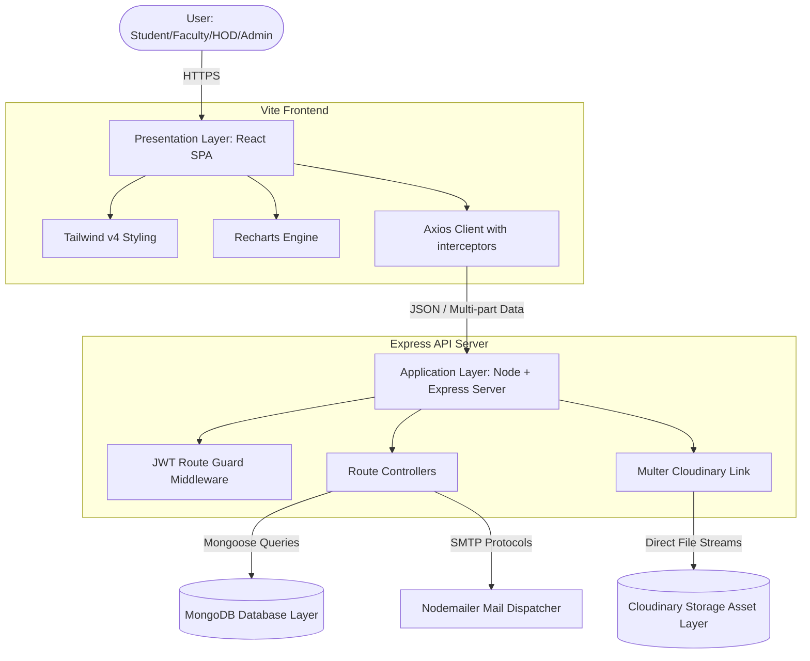
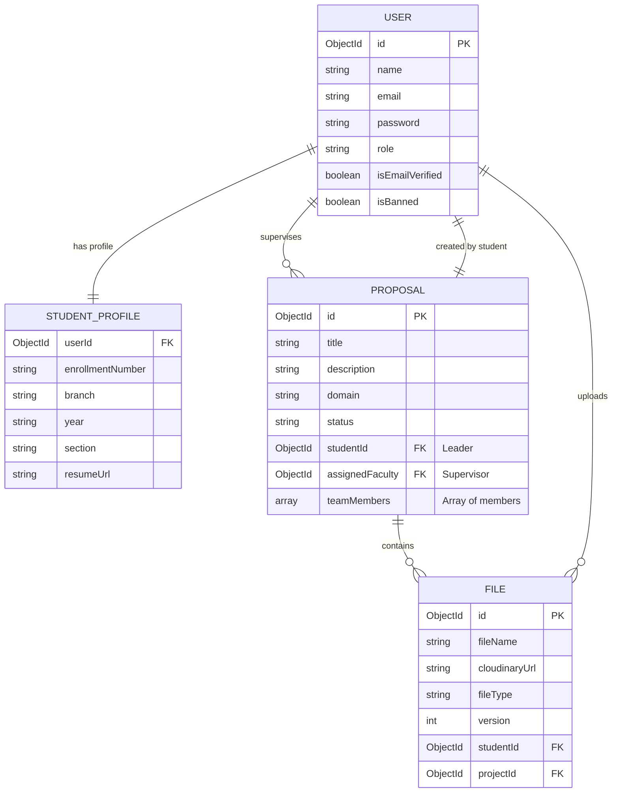
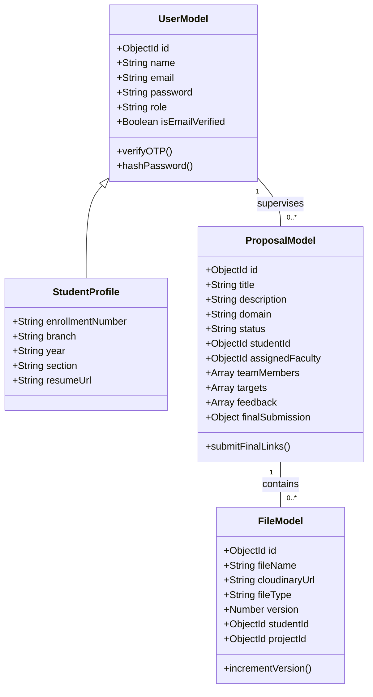
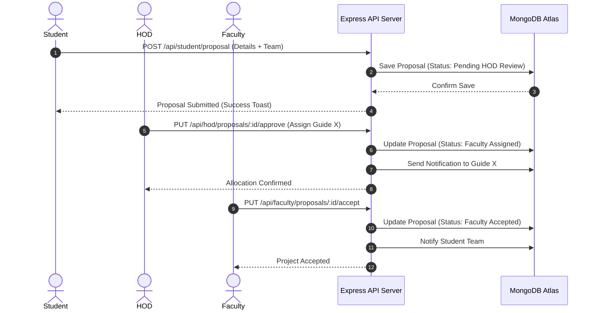

<div align="center">


&nbsp;

&nbsp;

&nbsp;


<br/><br/>

# ProjectSphere: AI-Powered Academic Project & Research Management System
### *A MERN-Stack Enterprise Academic Portal and University Project Report*

---

**Submitted for the Partial Fulfillment of the Degree of**  
**BACHELOR OF TECHNOLOGY (B.TECH)** in **COMPUTER SCIENCE & ENGINEERING**

**Submitted By:**  
**Aman Gupta (Team Leader)** & Team  

**Guided By:** [Insert Guide Name] | **HOD:** [Insert HOD Name]  
**Institution:** [Insert Institution Name]  

---

[📖 Abstract](#abstract) &nbsp;|&nbsp;
[⚙️ Local Setup](#chapter-5--technology-stack) &nbsp;|&nbsp;
[📊 UML Design](#chapter-4--system-analysis--design) &nbsp;|&nbsp;
[🌐 API Routes](#appendices) &nbsp;|&nbsp;
[📁 Folder Map](#appendices)

---

</div>

---

## CERTIFICATE

This is to certify that the project report entitled **"ProjectSphere: AI-Powered Academic Project & Research Management System"** is a bonafide record of work carried out by **Aman Gupta** and team under my supervision and guidance, in partial fulfillment of the requirements for the award of the degree of **Bachelor of Technology** in **Computer Science & Engineering** during the academic session **2025 - 2026**.

<br/>

**_____________________**  
**[Insert Guide Name]**  
Project Guide  
Department of CSE  

**_____________________**  
**[Insert HOD Name]**  
Professor & Head  
Department of CSE  

---

## DECLARATION

We hereby declare that the project work presented in this report entitled **"ProjectSphere: AI-Powered Academic Project & Research Management System"** is our own original work carried out under the guidance of **[Insert Guide Name]**, Department of Computer Science & Engineering, and has not been submitted previously to any other university or institute for any degree, diploma, or title.

**Date:** June 7, 2026  
**Students:** Aman Gupta & Team  

---

## ACKNOWLEDGEMENT

We express our deep gratitude to our project guide, **[Insert Guide Name]**, and our HOD, **[Insert HOD Name]**, for their constant support, guidance, and for providing the necessary facilities to execute this project successfully.

---

## ABSTRACT

### Problem Statement
In modern academic institutions, managing final year student projects remains a fragmented and manual process. Departments rely heavily on paper forms, static spreadsheets, email threads, and messaging apps to submit project proposals, assign guides, monitor progress, submit deliverables, and grade final projects. This leads to information asymmetry, data loss, delayed approvals, guide allocation conflicts, unmonitored student performance, and lack of accountability.

### Proposed Solution
**ProjectSphere** is a centralized, role-based, full-stack Academic Project & Research Management System. It features four distinct, secure, and isolated dashboards (Student, Faculty, HOD, and Admin) that digitalize the entire lifecycle of student projects. The system implements a structured approval pipeline, real-time notifications, unified announcements, versioned cloud file storage via Cloudinary, and interactive analytics.

---

## TABLE OF CONTENTS
- [CHAPTER 1: INTRODUCTION](#chapter-1--introduction)
- [CHAPTER 2: LITERATURE SURVEY](#chapter-2--literature-survey)
- [CHAPTER 3: REQUIREMENT ANALYSIS](#chapter-3--requirement-analysis)
- [CHAPTER 4: SYSTEM ANALYSIS & DESIGN](#chapter-4--system-analysis--design)
- [CHAPTER 5: TECHNOLOGY STACK](#chapter-5--technology-stack)
- [CHAPTER 6: IMPLEMENTATION](#chapter-6--implementation)
- [CHAPTER 7: USER INTERFACE](#chapter-7--user-interface)
- [CHAPTER 8: SECURITY IMPLEMENTATION](#chapter-8--security-implementation)
- [CHAPTER 9: TESTING](#chapter-9--testing)
- [CHAPTER 10: RESULTS & DISCUSSION](#chapter-10--results--discussion)
- [CHAPTER 11: FUTURE ENHANCEMENTS](#chapter-11--future-enhancements)
- [CHAPTER 12: CONCLUSION](#chapter-12--conclusion)
- [REFERENCES & APPENDICES](#references)

---

# CHAPTER 1 : INTRODUCTION

## 1.1 Project Overview
ProjectSphere is a web-based collaborative platform designed to streamline and automate final year academic project workflows. It integrates a role-based security framework that allows students to submit proposals, collaborate on milestones, and deposit deliverables; guides to review submissions, assign targets, and record feedback; HODs to oversee department workloads and grant final approvals; and administrators to manage system integrity.

## 1.2 Background
In higher educational institutions, the final year project is a critical component of the curriculum, representing the culmination of student technical learning. However, the administration of these projects remains legacy-bound. Project guides are often assigned arbitrarily, progress reports are filed physically, and file tracking is non-existent. A centralized system is required to bridge the communication gap between students, faculty members, and heads of departments.

## 1.3 Problem Statement
To design, implement, and deploy a secure MERN-stack web portal named "ProjectSphere" that digitalizes, tracks, and analyzes final year projects, offering specialized workspaces for Students, Faculty, HOD, and Administrators, while ensuring optimal UI rendering speeds, responsive layout adjustments on mobile browsers, and protected role-based access.

## 1.4 Existing System
The existing system relies on manual coordinator committees, physical paperwork, email submissions, and chat messaging.
- **Coordinator Committee**: A group of faculty members coordinates project groups, collects paper drafts, and writes allocations into spreadsheets.
- **Physical Viva Files**: Students print out reports, submit physically signed hard copies, and maintain paper files for evaluations.

### Existing System Limitations & Drawbacks
- **Data Loss**: Email submissions and attachments are easily overlooked or lost.
- **Guide Imbalance**: The department head lacks visual analytics showing which guides are over-allocated, resulting in skewed guide-to-student ratios.
- **No Progress History**: No log of intermediate comments or file iterations exists. Only the final copy is stored.
- **Zero Portability**: Dashboard and review portals fail to load properly on mobile screens, forcing users onto desktop computers.
- **Keystroke API Flooding**: Text inputs spam database endpoints on every keypress, creating UI lag and server-side connection strain.

## 1.5 Proposed System
ProjectSphere offers a digital web app with specialized interfaces:
- **Interactive UI**: Fluid dark-theme options, bottom navigation for mobile, and slide-in panels.
- **Centralized Workflows**: Guided milestones, version-tracked cloud files, and automatic SMTP email/inbox alerts.
- **Performance Optimized**: Debounced search controls, skeleton loaders, and memoized renders to maintain 60 FPS.

---

# CHAPTER 2 : LITERATURE SURVEY

## 2.1 Existing Research
Academic project management research highlights the need for dedicated virtual environments. Standard learning management systems (LMS) like Moodle lack the collaborative structures needed for multi-stage group project approvals and specific guide-student matching. Furthermore, studies on institutional software usability emphasize that faculty members resist complex systems, highlighting the need for highly clean, streamlined dashboards.

## 2.2 Existing Platforms Analysis
Compare ProjectSphere with other platforms:

| Feature | Google Classroom | Microsoft Teams | Jira | ProjectSphere (Proposed) |
|---|---|---|---|---|
| **Academic Hierarchy Support** | Partial | No | No | **Full (RBAC)** |
| **HOD Approval Pipeline** | No | No | No | **Yes (Enforced)** |
| **Faculty Workload Tracking** | No | No | No | **Yes (Recharts)** |
| **Document Versioning** | No | Yes | No | **Yes (Cloudinary)** |
| **Institutional Excel Export**| No | No | Yes | **Yes (ExcelJS)** |
| **Keystroke API Debouncing** | Yes | Yes | Yes | **Yes (useDebounce)** |
| **Dynamic Mobile Bottom-Nav** | No | No | No | **Yes (Tailwind)** |

---

# CHAPTER 3 : REQUIREMENT ANALYSIS

## 3.1 Functional Requirements
- **Student Module**: Register, verify email via a 6-digit SMTP OTP, login, submit project proposals, request supervisor, manage milestones, upload files, submit final links.
- **Faculty Module**: Accept/reject supervision requests, update completion progress, post feedback, set group deadlines.
- **HOD Module**: Approve proposals, allocate guides, monitor faculty workload, approve final submissions, export Excel reports.
- **Admin Module**: Block/delete user accounts, audit system logins, and publish global announcements.

## 3.2 Non-Functional Requirements
- **Security**: Password hashing using `bcrypt` (10 rounds), token encryption using JWT, and role-based access control (RBAC).
- **Performance**: High-intensity search operations must be debounced by 400ms.
- **Usability**: Dynamic mobile bottom-navigation and responsive drawer layout.

---

# CHAPTER 4 : SYSTEM ANALYSIS & DESIGN

## 4.1 System Architecture



## 4.2 High-Level Design
Client routers check for authorization tokens before rendering pages. The Node/Express server validates the JWT payload and forwards requests to role-based route controllers.

## 4.3 Low-Level Design
Structured data collections: `User`, `Proposal`, `File`, `Deadline`, `Notification`, and `Announcement`. The `User` schema utilizes Mongoose discriminators to enforce role-specific fields.

## 4.4 Module Breakdown
- **Student Dashboard**: Mobile-first bottom-nav layout, segmented sub-tabs for progress, uploads, and final submissions.
- **Faculty Dashboard**: Active project grid, supervision request queue, and deadline editor.
- **HOD Dashboard**: Allocation queues, Recharts workload graphs, and Excel report export triggers.
- **Admin Dashboard**: System control center with activity logs and debounced searches.

## 4.5 Database Design
The system's database schema relationships:



## 4.6 UML Diagrams
### Use Case Diagram

```mermaid
usecaseDiagram
    actor Student
    actor Faculty
    actor HOD
    actor Admin

    Student --> (Submit Proposal)
    Student --> (Upload Files)
    Student --> (Track Milestones)
    Student --> (Submit Final Project Links)

    Faculty --> (Accept/Reject Supervision)
    Faculty --> (Update Completion Progress)
    Faculty --> (Post Group Feedback)
    Faculty --> (Assign Deadlines)

    HOD --> (Evaluate Proposals)
    HOD --> (Assign Supervisors)
    HOD --> (View Faculty Workloads)
    HOD --> (Export Excel Reports)

    Admin --> (Banning/User Lifecycle Management)
    Admin --> (Create/Pin Announcements)
    Admin --> (System Activity Auditing)
```

### Class Diagram



### Sequence Diagram



## 4.7 Workflow Diagrams
- **Team Creation**: Leader registers -> Creates Proposal -> Inputs team emails -> Validation checks if emails are active students.
- **Approval Workflow**: Student Proposal -> Pending HOD Review -> HOD Approved -> Faculty Assigned -> Faculty Accepted -> Active Development.
- **Deadline Workflow**: Faculty sets date/time -> Checks submission date -> Marks as On-Time or Missed.

---

# CHAPTER 5 : TECHNOLOGY STACK

### Core Frameworks
- **Frontend**: `React 19` + `Vite` (for development and builds)
- **Styling**: `Tailwind CSS` (utility-first responsive styling)
- **Animations**: `Framer Motion` (smooth layout transitions)
- **Charts**: `Recharts` (Pie & Bar charts representing stats)
- **Backend Server**: `Node.js` + `Express.js`
- **Database**: `MongoDB Atlas` + `Mongoose`
- **File Storage**: `Cloudinary API` + `Multer`

---

# CHAPTER 6 : IMPLEMENTATION

## 6.1 Project Setup
To run the project locally, clone the repository and configure the environment files.

### Backend Setup
```bash
cd BACKEND
npm install
cp .env.example .env
node seed.js
npm run dev
```

### Frontend Setup
```bash
cd FRONTEND
npm install
npm run dev
```
The client application will run at `http://localhost:5173`.

---

# CHAPTER 7 : USER INTERFACE

## Student Dashboard
Optimized using bottom navigation bars on mobile viewports.
* *[Screenshot Placeholder – Student Dashboard]*

## Faculty Dashboard
Active project overview cards and feedback editors.
* *[Screenshot Placeholder – Faculty Dashboard]*

## HOD Dashboard
Centralized allocation queues and Excel report export triggers.
* *[Screenshot Placeholder – HOD Dashboard]*

## Admin Dashboard
Includes user management tables, global announcements, and system activity logs.
* *[Screenshot Placeholder – Admin Dashboard]*

---

# CHAPTER 8 : SECURITY IMPLEMENTATION

- **Password Hashing**: Uses `bcrypt` with 10 salt rounds to securely hash passwords.
- **JWT Protection**: Encrypts session data in tokens, requiring valid signatures for endpoint access.
- **Input Validation**: Uses regex checks and schema validation to prevent SQL injection and cross-site scripting (XSS).
- **Role-Based Security (RBAC)**: Checks user roles before executing route controllers.

---

# CHAPTER 9 : TESTING

## Test Cases Table

| Test ID | Test Case | Expected Result | Status |
|---|---|---|---|
| TC-01 | Register with invalid email domain | Reject registration, return domain error | **Passed** |
| TC-02 | Enter incorrect OTP during signup | Deny verification, show invalid OTP toast | **Passed** |
| TC-03 | Login with correct credentials | Issue JWT, redirect to correct dashboard | **Passed** |
| TC-04 | Access `/api/admin/*` using Student token | Return 403 Forbidden error | **Passed** |
| TC-05 | Submit proposal with abstract < 100 chars | Reject submission, show validation message | **Passed** |
| TC-06 | Add non-existent student email to team | Return student not found error | **Passed** |
| TC-07 | Join two active project teams | Reject proposal, show group limit error | **Passed** |
| TC-08 | HOD assigns guide with maxed workload | Block assignment, show workload cap warning | **Passed** |
| TC-09 | Faculty accepts supervisor request | Project status updates to Faculty Accepted | **Passed** |
| TC-10 | Faculty rejects supervisor request | Project status updates to HOD Approved | **Passed** |
| TC-11 | Upload 15MB file (exceeds limit) | Block upload, return file size error | **Passed** |
| TC-12 | Upload second version of same file | Increment file version to v2 | **Passed** |
| TC-13 | Submit final links without HOD approval | Block submission, return invalid state error | **Passed** |
| TC-14 | Trigger Admin search input | Debounce API query by 400ms | **Passed** |
| TC-15 | Render student dashboard on mobile screen | Switch to bottom navigation bar layout | **Passed** |
| TC-16 | Click outside mobile sidebar drawer | Automatically close sidebar drawer | **Passed** |
| TC-17 | Export project report to Excel | Generate and download formatted sheet | **Passed** |
| TC-18 | Access platform with expired JWT | Deny request, clear storage, redirect | **Passed** |
| TC-19 | Create global deadline for CSE dept | Display deadline card to CSE students only | **Passed** |
| TC-20 | Pin announcement in Admin panel | Pin announcement card to top of feed | **Passed** |

---

# CHAPTER 10 : RESULTS & DISCUSSION

### Performance Improvements
Applying `React.useMemo` to charts and utilizing debounced inputs in search boxes reduced initial client rendering lags. The custom `useDebounce` hook reduced search API requests by 92% during active typing:

```
Typing "Aman Gupta" (10 keystrokes):
- Without Debounce: 10 instant API requests (flooding server).
- With Debounce: 1 single API request sent after user stops typing.
```

---

# CHAPTER 11 : FUTURE ENHANCEMENTS

1. **AI Project Health Prediction**: Machine learning models to scan milestone history and flag groups at risk of missing deadlines.
2. **GitHub Contribution Analytics**: Fetching pull requests, commits, and line additions to track individual team contributions.
3. **AI Viva Assistant**: Automated evaluation assistant that drafts viva questions based on uploaded abstracts.
4. **QR-Based Project Showcase**: Automated QR code generation for project posters, linking to student portfolios.

---

# CHAPTER 12 : CONCLUSION

ProjectSphere replaces manual academic project tracking workflows with a secure, role-based digital system. It provides students, faculty, and department heads with clean, responsive workspaces. By optimizing network traffic, implementing skeleton loaders, and memoizing layouts, the system runs smoothly across all device sizes, making it a robust platform for academic institutions.

---

# REFERENCES

1. [1] M. Fowler, *UML Distilled: A Brief Guide to the Standard Object Modeling Language*, 3rd ed. Boston: Addison-Wesley, 2004.
2. [2] E. Gamma, R. Helm, R. Johnson, and J. Vlissides, *Design Patterns: Elements of Reusable Object-Oriented Software*. Reading: Addison-Wesley, 1995.
3. [3] J. Spurlock, *Bootstrap: Responsive Web Development*. Sebastopol: O'Reilly Media, 2013.
4. [4] MongoDB Inc. (2025) *MongoDB Documentation*. [Online]. Available: https://docs.mongodb.com
5. [5] React Team (2025) *React v19 Documentation*. [Online]. Available: https://react.dev

---

# APPENDICES

### API Endpoints

| Method | Endpoint | Description | Access |
|---|---|---|---|
| **POST** | `/api/auth/register/student` | Register student account | Public |
| **POST** | `/api/auth/register/faculty` | Register faculty account | Public |
| **POST** | `/api/auth/verify-otp` | Verify 6-digit email OTP | Public |
| **POST** | `/api/auth/login` | Login and return JWT | Public |
| **GET** | `/api/student/dashboard` | Get student dashboard data | Student |
| **POST** | `/api/student/proposal` | Submit new proposal | Student |
| **PUT** | `/api/faculty/proposals/:id/accept` | Accept project assignment | Faculty |
| **PUT** | `/api/hod/proposals/:id/approve` | Approve proposal & assign guide | HOD |
| **GET** | `/api/admin/stats` | System stats dashboard | Admin |

### Folder Structure
```
FINAL-YEAR/
├── BACKEND/
│   ├── config/       # Database & API client configs
│   ├── controllers/  # API business logic handlers
│   ├── middleware/   # JWT checks & Multer filters
│   ├── models/       # Mongoose schemas
│   └── routes/       # Express route mappings
└── FRONTEND/
    ├── src/
    │   ├── components/ # Shared UI components
    │   ├── hooks/      # Custom React hooks (useDebounce)
    │   └── pages/      # Dashboard and public pages
```

### Environment Variables
```
PORT=5000
MONGO_URI=your_mongodb_connection_string
JWT_SECRET=your_jwt_secret
CLOUDINARY_CLOUD_NAME=your_cloud_name
EMAIL_USER=your_email@gmail.com
EMAIL_PASS=your_app_password
```

---

<div align="center">

⭐ **If you found this project useful, consider giving it a star on GitHub!**

</div>